  
  

# TABEL Employees

>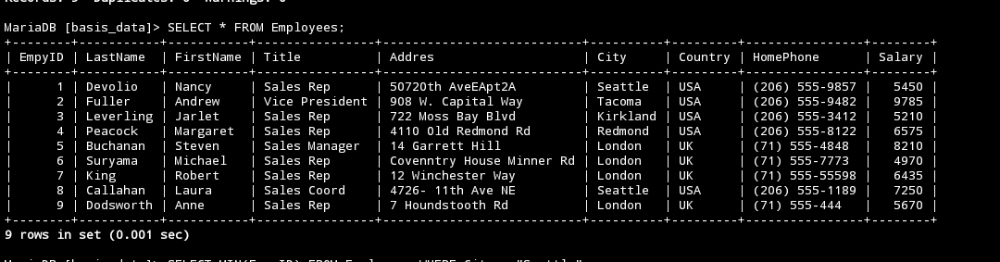
# TABEL Orders

> 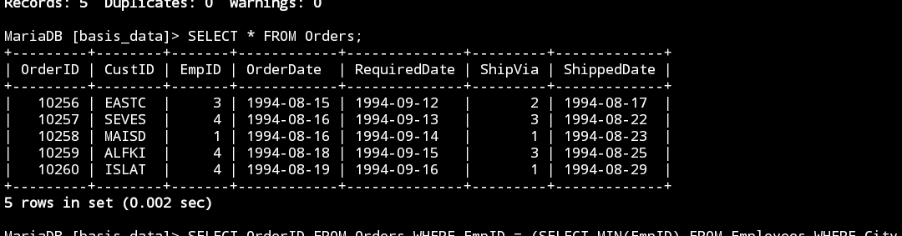


---
# 1 (Fachri)

## Query
```MySQL
SELECT * FROM employees WHERE
    -> City = (SELECT City FROM employees WHERE LastName = 'Callahan');
```

## Hasil
> 

## Analisis
- `Select` : untuk memilih kolom mana saja yang inging di tampilkan.
- `FROM employees` : merupakan nama tabel yang dipilih untuk ditampilkan.
- `WHERE` : Kondisi yang harus dipenuhi suatu data agar dapat ditampilkan
- `City = (SELECT City FROM employees WHERE LastName = 'Callahan');` : Merupakan kondisi yang dipilih untuk menampilkan data yang di inginkan.

---
# 2 (Caca)

## Query
```MySQL
select * from employees where
    salary < (select avg(salary) from employees);
```

## Hasil
> 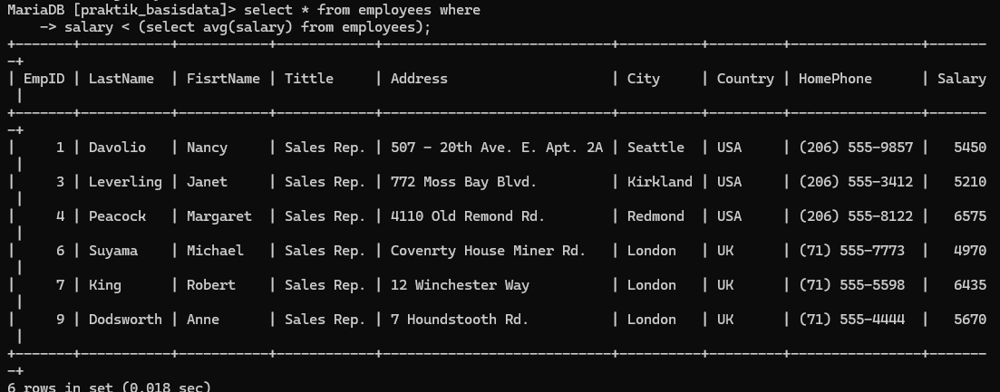

## Analisis
`select` : Untuk memilih kolom nama saja yang ingin di tampilkan.
`*` : Tanda untuk memilih semua kolom pada tabel  yang dipilih.
`from employees` : Merupakan nama tabel yang dipilih  untuk di tampilkan  kolomnya.
`where` : Kondisi yang harus dipenuhi suatu data agar dapat ditampilkan.
`(salary <(select avg(salary) from employees` : Merupakan kondisi dari where.

---
# 3 (Caca)

## Query
```MySQL
select * from employees
    where empid not in(select empid from orders);
```

## Hasil
> 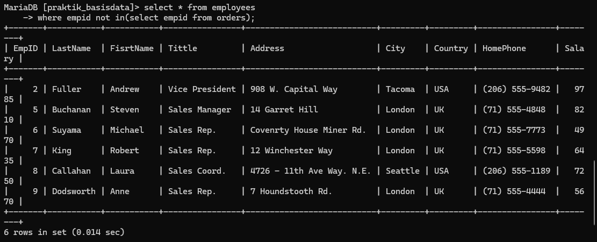> 

## Analisis
`select` : Untuk memilih kolom mana saja yang ingin ditampilkan.
`*` : Tanda untuk memilih semua kolom yang ada dalam tabel yang dipilih.
`from employees` : Merupakan nama dari tabel yang dipilih untuk ditampilkan kolomnya.
`where` : Kondisi yang dipenuhi suatu data agar bisa dutampilkan.
`(empid not in(select empid from orders)` : Kondisi dari where yang harus dipenuhi

---
# 4 (Caca)
## Query
```MySQL
select * from employees
where salary > (select max(salary) from employees where
titte = "sales Rep.");
```

## Hasil
> 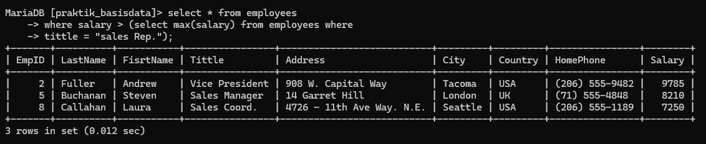

## Analisis
`Select`= untuk memilih kolom mana saja yang ingin ditampilkan.
`*`= Tanda untuk memilih semua kolom yang ada dalam tabel yang dipilih.
`From employees` = merupakan nama dari tabel yang dipilih untuk ditampilkan kolomnya
`Where` = kondisi yang harus dipenuhi oleh suatu agar bisa ditampilkan .
`(Salary) > (Select max(salary)from employees where tittle` = "sales Rep.") = Kondisi dari where yang harus dipenuhi agar datanya bisa tampil.

---
# 5 (Hansar)

## Query
```MySQL
Select * from orders;
```

## Hasil
> 

## Analisis
Langkah Pertama = kita lihat dan tampilkan dulu isi dari semua tabel order untuk mengetahui orderID Yang ingin kita tampilkan. Di barisan data ke-3 Yaitu orderID 10258 Yang mempunyai EmPID 1.  

---
# 6 (Hansar)
## Query
```MySQL
IN(SELECT EmpID FROM orders GROUP BY EmpID HAVING COUNT (EmpID) = 1);
```

## Hasil
> 

## Analisis
SELECT = untuk memilih kolom mana saja yang ingin ditampilkan. *= tanda untuk memilih semua kolom Yang ada dalam tabel yang dipilih.
From Employees = merupakan nama dari tabel rand dipilih untuk ditampilkan koromnya. - WHERE = kondisi Yang harus dipenuhi oleh suatu data asar bisa ditampilkan. - (EMPID IN (SELECT EMPID FROM Orders GROUP BY EMPID HAVING COUNT (EMPID) = 1))
> Kondisi dari WHERE Yang harus dipenuhi. GROUP BY EMPID untuk mengelompokkan Folom EMPID dengan datanya Yang Sama. COUNT (untuk menghitung berapa banyak data Buda Kolom Yang dipilih).

Hasilnya kita ingin mencari Pegawai Yang telah melakukan transaksi sebanyak 1

Satu kali Pada tabel orders. (seperti sebeium-sebelumnya) dalam tabel orders terdapat 3 EmPID Yond telah melakukan transaksi Yaitu 1,3 dan 4. Diantara ketida pegawai ini kita akan mencari terlebih dahulu berala buntat transaksi Yang dilakukan masing-masing lesawai tersebut dengan mρηθθυπακοη COUNT untuk menghitun berapa banyak data Yang sama (beruland). dendan kondisi sama dengan satu. Berarti kita hanya menampilkan EMPED Yory hanya tamil sekali. Dengan mengeremparkan datanya, lalu menghitung berad kali datanya berulang kita dapat mendapatkan Emp TD 1 dan 3 tandhana tampil sekali Yand berarti telah melakukan transaksi sebartak satu kali  

---
# 7 (Hansar)

## Query
```MySQL
(SELECT MAX (EmpID) FROM employees WHERE city = "seattle");
```

## Hasil
> 

## Analisis
kenapa tidak ada yang tampil ? (Empty set)
100000
= Ini dikarenakan subquerynya. Disitu kita mencari EmPID tertinggi Yang katanya "Seattie". EmPID Yang memiliki kota seattle adalah 1 dan 8, diantara kedua Hu Yang tertingdi atau max adalah EmPID 8. (lebih besar dari 1) - ketika kita ke tabel orders hanya terdapat 3 Jenis EmPID Yaitu 1,3 dan 4. Jika kita ingin mexami orderID dari tabel orders dengan kondisi Empil niya sama dengan CEMPID tertiasli dari kota Seattle Yaitu EmPID 8). Tidak ada yang akan tampil karena di tabel orders tidak ada EMPTD & (hanya 1,3 dan 4).

---
# 8 (Jordan)

## Query
```MySQL
SELECT * FROM employees;

  

```

  
  

## Hasil

  

> 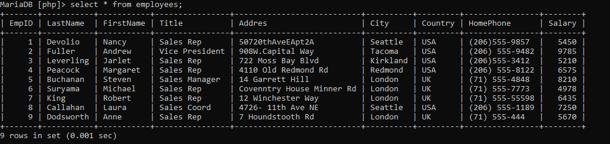

  
  

## Analisis

  

- *SELECT*: Ini adalah kata kunci dalam SQL yang digunakan untuk memilih atau mengambil data dari database.

- ***** (Asterisk): Tanda asterisk digunakan sebagai wildcard yang berarti "semua kolom". Jadi, perintah ini akan mengambil semua kolom yang tersedia di tabel yang ditentukan.

- *FROM employees*: Ini adalah klausa FROM yang menunjukkan tabel yang akan digunakan untuk mengambil data. Dalam hal ini, tabel yang digunakan adalah "employees".

  
  
  
  
  

---

  
  
  
  

# 9 (Jordan)

  
  

## Query

  

```MySQL

  

SELECT EmpID,Lastname,City FROM Employees;

  

```

  
  

## Hasil

  

> 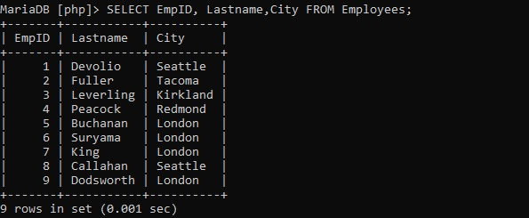

  
  

## Analisis

  

- *SELECT*: Ini adalah kata kunci dalam SQL yang digunakan untuk memilih atau mengambil data dari database.

- *EmpID, Lastname, City*: Ini adalah nama kolom yang ingin Anda ambil dari tabel "Employees".

- *FROM Employees*: Ini adalah klausa FROM yang menunjukkan tabel yang akan digunakan untuk mengambil data. Dalam hal ini, tabel yang digunakan adalah "Employees".

  
  
  
  
  

---

  
  
  

# 10 (Jordan)

  
  

## Query

  

```MySQL

  

Select empID, LaseName, City From Employees WHERE City = "Seattle";

  

```

  
  

## Hasil

  

> 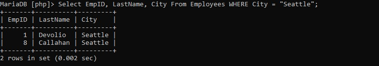

  
  

## Analisis

  

- *SELECT*: Ini adalah kata kunci dalam SQL yang digunakan untuk memilih atau mengambil data dari database.

- *EmpID, LastName, City*: Ini adalah nama kolom yang ingin Anda ambil dari tabel "Employees".

- *FROM Employees*: Ini adalah klausa FROM yang menunjukkan tabel yang akan digunakan untuk mengambil data. Dalam hal ini, tabel yang digunakan adalah "Employees".

- *WHERE City = 'Seattle'*: Ini adalah klausa WHERE yang memberikan kriteria untuk mengambil data. Dalam hal ini, kita hanya akan mengambil data di mana nilai kolom "City" sama dengan "Seattle".

  
  
  
  
  

----

  
  

# 11 (Nafan)

  

## Query

  

```mysql

INSERT INTO tabel_guru (OrderID, CustID, EmpID, OrderDate, RequiredDate, ShippedDate, ShipVia)

    -> VALUES

    -> (10256, 'EASTC', 3, '1994-08-15', '1994-09-12', '1994-08-17', 2),

    -> (10257, 'SEVES', 4, '1994-08-16', '1994-09-13', '1994-08-22', 3),

    -> (10258, 'MAISD', 1, '1994-08-16', '1994-09-14', '1994-08-23', 1),

    -> (10259, 'ALFKI', 4, '1994-08-18', '1994-09-15', '1994-08-25', 3),

    -> (10260, 'ISLAT', 4, '1994-08-19', '1994-09-16', '1994-08-29', 1);

```

  
  

## Hasil

  

> 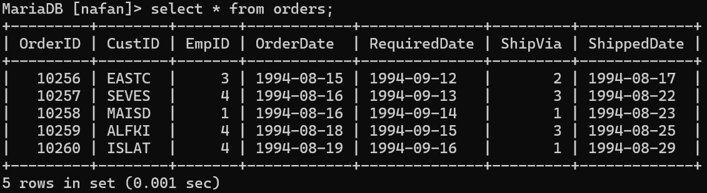

  
  
  

## Analisis

  

Program ini adalah contoh output dari sebuah tabel "orders" dalam format yang mirip dengan tabel yang ada dalam database relasional. Tabel ini mungkin digunakan untuk melacak pesanan dalam sebuah sistem, dan setiap baris mewakili satu pesanan dengan informasi yang terkait.

1. **OrderID**: Ini adalah ID unik untuk setiap pesanan. Setiap pesanan memiliki nomor ID yang berbeda.

2. **CustID**: Ini adalah ID atau kode pelanggan yang melakukan pesanan. Setiap pelanggan memiliki kode yang berbeda. Perhatikan bahwa untuk OrderID 10260, nilai CustID diganti dari 'ALFKI' menjadi 'ISLAT'.

3. **EmpID**: Ini adalah ID karyawan yang memproses pesanan.

4. **OrderDate**: Ini adalah tanggal ketika pesanan dibuat.

5. **RequiredDate**: Ini adalah tanggal ketika pelanggan meminta pesanan tersebut harus dipenuhi.

6. **ShipVia**: Ini mungkin adalah metode pengiriman yang digunakan untuk pesanan tersebut.

7. **ShippedDate**: Ini adalah tanggal ketika pesanan dikirim.

  

- Memeriksa bagaimana data ini digunakan dalam sistem yang lebih besar.

- Melakukan analisis tren pada data pesanan dari waktu ke waktu.

- Melakukan pemrosesan lebih lanjut atau analisis statistik terhadap pesanan, misalnya, total penjualan, rata-rata jumlah pesanan, atau metode pengiriman yang paling umum digunakan.

  
  
  

---

  
  

# 12 (Nafan)

  

## Query

  

```mysql

select * from orders where empid = 1;

```

  
  
  

## Hasil

  

> 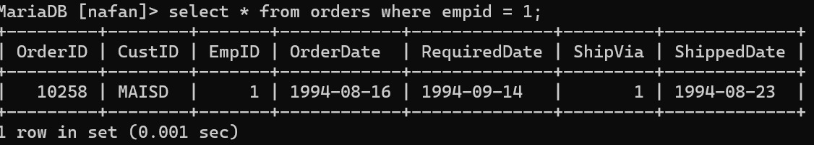

  
  
  

## Analisis

  

Output program menunjukkan satu baris data dari tabel orders. Berikut adalah analisis singkat

  

1. **OrderID**: Nomor pesanan adalah 10258.

2. **CustID**: Kode pelanggan yang melakukan pesanan adalah 'MAISD'.

3. **EmpID**: Karyawan dengan ID 1 yang memproses pesanan.

4. **OrderDate**: Pesanan dibuat pada tanggal 16 Agustus 1994.

5. **RequiredDate**: Pelanggan meminta pesanan harus dipenuhi pada tanggal 14 September 1994.

6. **ShipVia**: Metode pengiriman yang digunakan adalah 1.

7. **ShippedDate**: Pesanan dikirim pada tanggal 23 Agustus 1994.

  

Analisis program ini terbatas pada satu baris data, sehingga informasi yang diberikan tidak memberikan gambaran yang lengkap tentang kinerja keseluruhan sistem atau tren pesanan. Namun, kita dapat menyimpulkan bahwa pesanan ini diproses dengan sukses, dan pengiriman dilakukan dalam waktu yang wajar, yaitu pada tanggal 23 Agustus 1994, beberapa hari setelah pesanan dibuat.

  
  
  

---

  
  
  

# 13 (Nafan)

  

## Query

  

```mysql

SELECT OrderID From orders where EmpID = 1;

```

  
  
  

## Hasil

  

> 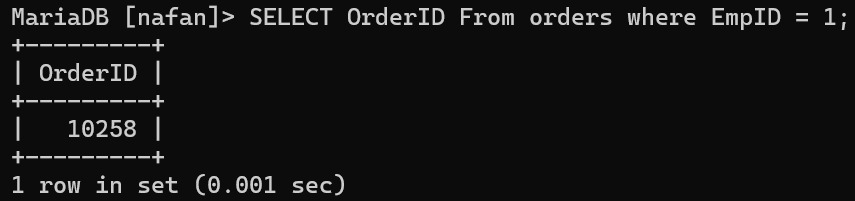

  
  
  

## Analisis

  

Query ini bertujuan untuk menampilkan OrderID dari pesanan yang diproses oleh karyawan dengan ID 1. Output dari query ini adalah OrderID dari pesanan-pesanan tersebut. Dalam hal ini, hanya satu pesanan yang diproses oleh karyawan dengan ID 1, yaitu pesanan dengan OrderID 10258.

  
  
  
  

---

  
  
  
  
  

# 14 ( Farel )

  
  

## QUERY

  

```MySQL

  

SELECT MIN(EmpyID) FROM Employees WHERE City = "Seattle";

  

```

  
  

## HASIL

  

> 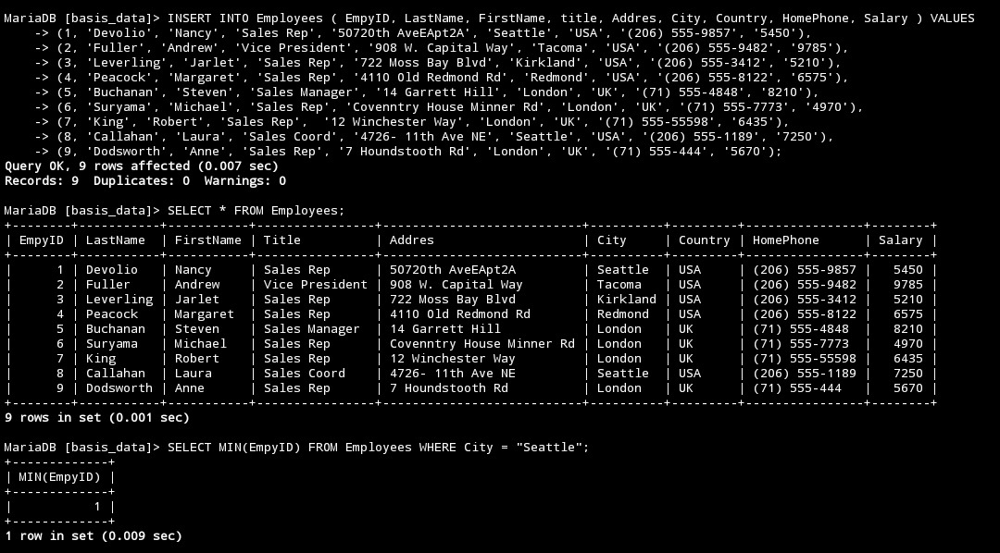

  
  

## ANALISIS

  

1. **Fungsi Agregasi: `MIN`**

    - Fungsi `MIN` digunakan untuk mencari nilai minimum dari kolom yang ditentukan. Dalam hal ini, kolom yang ditentukan adalah `EmpyID`.

2. **Kolom yang Dipilih: `EmpyID`**

    - Kode tersebut memilih kolom `EmpyID` dari tabel `Employees`.

3. **Kondisi `WHERE`:**

    - Kondisi `WHERE` membatasi hasil query hanya pada baris-baris di mana nilai kolom `City` adalah "Seattle".

4. **Tabel yang Ditargetkan: `Employees`**

    - Query ini dijalankan pada tabel `Employees`.

  

Secara keseluruhan, query ini mencari nilai `EmpyID` terkecil di antara semua baris dalam tabel `Employees` yang memiliki `City` bernilai "Seattle".

  
  
  
  
  

---

  
  
  

# 15 ( Farel )

  
  

## Query

  

```MySQL

  

SELECT OrderID FROM Orders WHERE EmpID = (SELECT MIN(EmpyID) FROM Employees WHERE City = "Seattle");

  

```

  
  

## Hasil

  

> 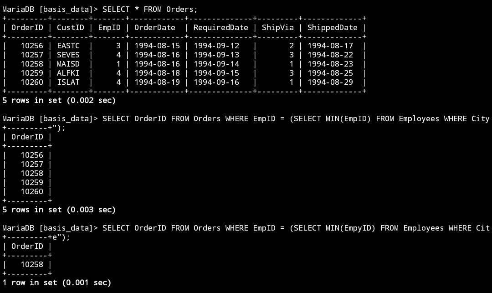

  
  
  

## Analisis

  
  

1. **Tujuan:** Mendapatkan `OrderID` dari tabel `Orders` yang ditempatkan oleh karyawan dengan `EmpyID` terkecil di kota Seattle.

2. **Subquery:**

    - Menemukan `EmpyID` terkecil dari karyawan di Seattle:

3. **Query Utama:**

    - Memilih `OrderID` dari tabel `Orders` di mana `EmpID` sama dengan hasil dari subquery tersebut.

  
  

 Pastikan `EmpyID` adalah nama kolom yang benar.

 Indeks pada kolom `City` (tabel `Employees`) dan `EmpID` (tabel `Orders`) dapat meningkatkan kinerja.